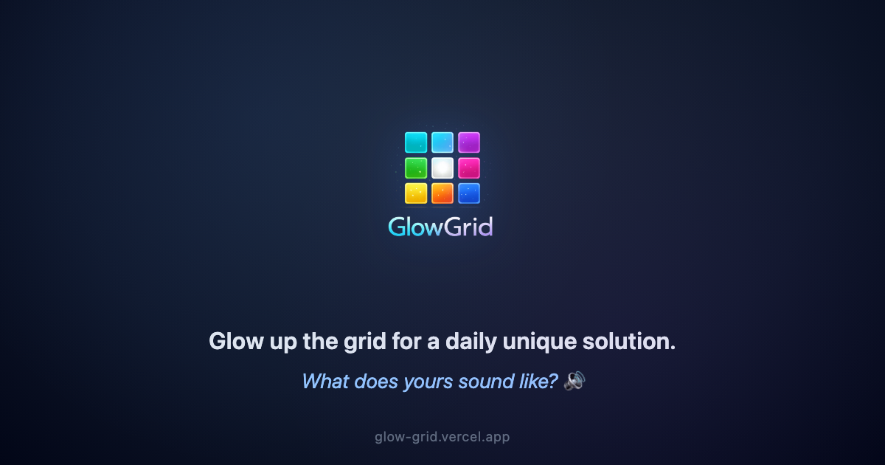

# GlowGrid ✨

A daily puzzle game inspired by [Lights Out](https://en.wikipedia.org/wiki/Lights_Out_(game)). Light up all the cells in the grid — each tap toggles a cell and its neighbors. Every day brings a unique puzzle with a guaranteed solution.

🎮 **[Play now](https://glow-grid.vercel.app)**



## How to Play

1. Tap any cell to toggle it and its neighbors
2. **ON cells** activate adjacent cells in a **+** pattern
3. **OFF cells** activate adjacent cells in an **×** pattern
4. Light up all 25 cells to win
5. Every puzzle is solvable — find the optimal path!

## Features

- 🗓 **Daily puzzles** — a unique puzzle every day, seeded by date
- 🔥 **Streaks** — track consecutive days solved
- 🎵 **Musical tiles** — each cell plays a unique note from a pentatonic scale
- 🔄 **Interactive replay** — watch your solution play back step by step
- 🗺 **Heatmap view** — see which cells you clicked the most
- 📤 **Share** — export your replay as a video (with sound) or share a link
- 💡 **Smart hints** — available when you're close to solving
- 📱 **Mobile-first** — haptic feedback, long-press preview, no double-tap zoom
- 🌈 **Colorful grid** — each cell has a unique rainbow color
- 📶 **Works offline** — full PWA with service worker caching

## Tech Stack

Single HTML file. No frameworks, no build step, no dependencies.

- **Rendering:** Vanilla HTML + CSS (inline)
- **Logic:** Vanilla JavaScript (inline)
- **Audio:** Web Audio API (synthesized in real-time, no audio files)
- **Haptics:** `navigator.vibrate()` + iOS Safari checkbox trick
- **Video export:** Canvas + MediaRecorder API
- **Offline:** Service Worker + Cache API
- **Hosting:** Vercel

## Documentation

- [Puzzle Generation](docs/puzzle-generation.md) — how each day's unique puzzle is created and why it's always solvable
- [Solver Algorithm](docs/solver-algorithm.md) — bidirectional BFS solver, greedy fallback, and hint system
- [Color System](docs/color-system.md) — rainbow hue assignment, glow effects, and visual states
- [Sound Design](docs/sound-design.md) — how tile frequencies, sound types, and the audio pipeline work
- [Replay URL Encoding](docs/replay-url-encoding.md) — how puzzle solutions are encoded in shareable URLs

## URL Parameters

| Parameter | Description | Example |
|-----------|-------------|---------|
| `p` | Puzzle number (days since Jan 1, 2025) | `?p=497` |
| `r` | Encoded move sequence (A-Y = regular, a-y = hint) | `?p=497&r=AGLR` |
| `own` | View shared replay as your own win screen | `?p=497&r=AGLR&own=1` |

## Project Structure

```
index.html           # The entire game (HTML + CSS + JS)
manifest.json        # PWA web app manifest
sw.js                # Service worker for offline caching
og-image.html        # OG preview image template
og-image.png         # Generated OG preview image
generate-og.sh       # Script to regenerate OG image
robots.txt           # SEO robots file
sitemap.xml          # SEO sitemap
glowgrid-logo.png    # Full logo with text
glowgrid-logo-only.png # Logo icon only
favicon-16.png       # Favicon 16×16
favicon-32.png       # Favicon 32×32
favicon-192.png      # PWA icon 192×192
apple-touch-icon.png # iOS home screen icon 180×180
docs/
  sound-design.md    # Sound system documentation
```

## Development

No build step required. Serve locally:

```bash
npx serve .
```

> ⚠️ Don't use `file://` URLs — clipboard API, service workers, and some security features require HTTP.

Regenerate the OG preview image:

```bash
./generate-og.sh
```

## License

MIT

---

*Vibe coded with ❤️ by [Erwann](http://erwann.lovable.app)*
